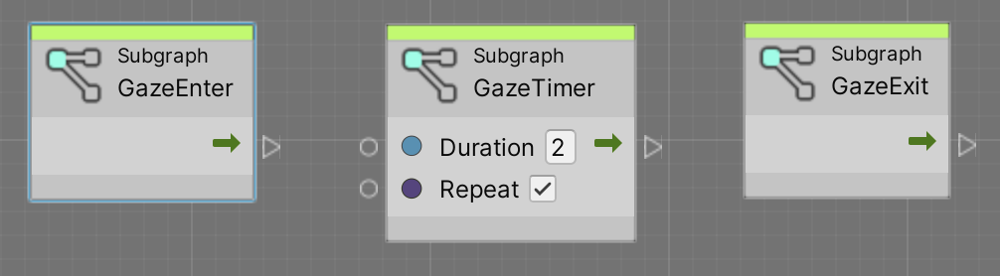
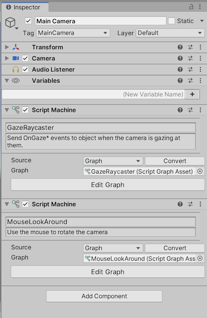
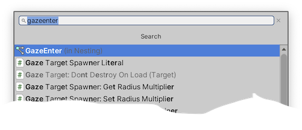
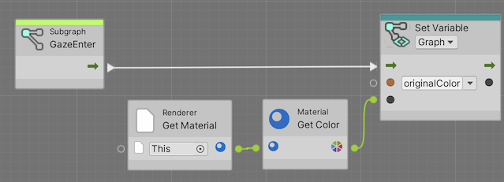

# VS Gaze Detector

A gaze detector using Visual Scripting.

[https://github.com/prossel/VS-gaze-detector](https://github.com/prossel/VS-gaze-detector)

## Installation

* Download latest .unitypackage file from [https://github.com/prossel/VS-gaze-detector/releases](https://github.com/prossel/VS-gaze-detector/releases)
* Add to your unity project

## Getting started

### Add the GazeRaycaster to the camera

* Add a Script Machine component to the Main Camera game object
* Select the GazeRaycaster graph
* Optionnally add another script machine connected to the Mouse Look Around graph

  

### Use the gaze events

* Add a script machine to an object your want to react on gaze events
* Edit the graph
* Use the fuzzy finder to add a OnGazeEnter (in Nesting) subgraph
  
* Connect the OnGazeEnter node to whatever you want
  
* Repeat the same process for the OnGazeExit or OnGazeTimer

### OnGazeTimer

The OnGazeTimer event triggers its output after a configurable delay (duration input parameter) has elapsed, following the OnGazeEnter event. It does not trigger if the OnGazeExit occurs before the duration.

When the repeat parameter is checked, then the timer will trigger again after each duration.

## Detailed tutorial

[Douglas Edric Stanley](https://github.com/abstractmachine) wrote a [nice and detailed tutorial using VS-gaze-detector](https://abstractmachine.net/en/tutorials/unity-vr/gaze).

## History

See [CHANGELOG.md](CHANGELOG.md)
