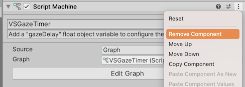
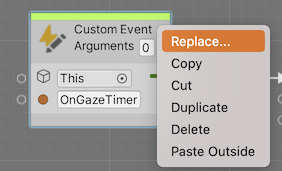
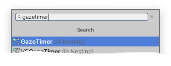
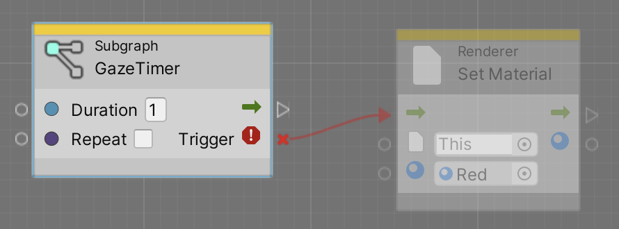
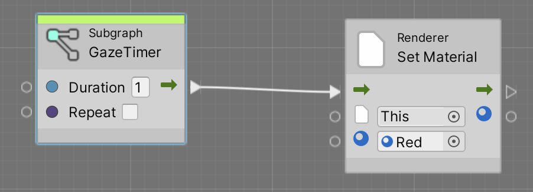
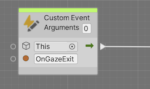
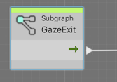

# How to upgrade

## Upgrade from 1.1 to 1.2

### Replace VsGazeTimer by GazeTimer

VSGazeTimer is deprecated. Using GazeTimer subgraph is much easier to use.

* Remove Script Machines using VsGazeTimer graphs

  

* Replace CustomEvent for OnGazeTimer with GazeTimer subgraph

  

  

* Remove the broken link (right click the red link)

  

* Connect the new output

  

### Replace CustomEvents for OnGazeEnter and OnGazeExit

This step is optional, but using the GazeEnter and GazeExit subgraphs is much more intuitive and they are available in the fuzzy finder, so using them avoids typos on CustomEvent names.

* Replace the OnGazeExit CustomEvent

  

  by the GazeExit subgraph

  
